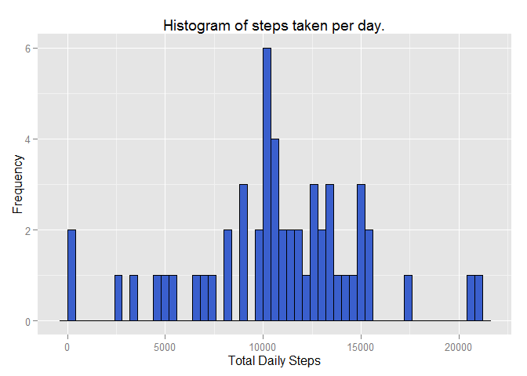

# Reproducible Research: Peer Assessment 1

```r
library(ggplot2)
```

## Loading and preprocessing the data

```r
if (!file.exists("activity.csv")) {
  unzip("activity.zip")
}

activity <- read.csv("activity.csv", stringsAsFactors = FALSE)

activity$date <- as.Date(activity$date, format = "%Y-%m-%d")
```

## What is mean total number of steps taken per day?

```r
totalStepsByDate <- aggregate(steps ~ date, data = activity, sum, na.action = na.omit)
```


```r
print(
  qplot(
    x = steps, 
    data = totalStepsByDate, 
    geom = "histogram", 
    color = I("black"), 
    fill = I("royalblue3"), 
    binwidth = 400, 
    main = "Average number of steps taken by 5-minute intervals", 
    xlab = "5-minute Interval", 
    ylab = "Step Frequency"
  )
)
```

 

The mean of the total number of steps is:

```r
mean(totalStepsByDate$steps)
```

```
## [1] 10766.19
```

The median of the total number of steps is:

```r
median(totalStepsByDate$steps)
```

```
## [1] 10765
```


## What is the average daily activity pattern?

```r
averageStepsByInterval <- aggregate(steps ~ interval, data = activity, mean, na.action = na.omit)

print(
  qplot(
    interval, 
    steps, 
    data = averageStepsByInterval, 
    geom = "line", 
    main = "Average number of steps taken by 5-minute intervals", 
    xlab = "5-minute Interval", 
    ylab = "Average Steps"
  )
)
```

 

The 5-minute interval with the maximum steps on average is:

```r
averageStepsByInterval[averageStepsByInterval$steps ==max(averageStepsByInterval$steps), ]
```

```
##     interval    steps
## 104      835 206.1698
```

## Imputing missing values

Total number of missing values

```r
sum(is.na(activity$steps))
```

```
## [1] 2304
```

### Replace missing values with the mean for the 5-minute interval
Step 1: Merge activity and averageStepsByInterval datasets

```r
activityImputed <- merge(activity, averageStepsByInterval, by.x = "interval", by.y = "interval")
names(activityImputed) <- c("interval", "steps", "date", "meanStepsByInterval")
```

Step2: replace NA values with mean value.

```r
activityImputed$steps[is.na(activityImputed$steps)] <- activityImputed[is.na(activityImputed$steps), "meanStepsByInterval"]
```

As before, show histogram, mean and median, this time with imputed data.

```r
totalStepsByDateImputed <- aggregate(steps ~ date, data = activityImputed, sum)

print(
  qplot(
    x = steps, 
    data = totalStepsByDateImputed, 
    geom = "histogram", 
    color = I("black"), 
    fill = I("seagreen4"), 
    binwidth = 400, 
    main = "Average number of steps taken by 5-minute intervals", 
    xlab = "5-minute Interval", 
    ylab = "Step Frequency"
  )
)
```

 

The mean of the total number of steps is:

```r
mean(totalStepsByDateImputed$steps)
```

```
## [1] 10766.19
```
---
The median of the total number of steps is:

```r
median(totalStepsByDateImputed$steps)
```

```
## [1] 10766.19
```


## Are there differences in activity patterns between weekdays and weekends?

```r
activityImputed$daytype <- factor(ifelse(weekdays(activityImputed$date) %in% c("Saturday", "Sunday"), "weekend", "weekday"))

averageStepsByIntervalAndDayType <- aggregate(steps ~ interval + daytype, data = activityImputed, mean)

print(
  qplot(
    interval, 
    steps, 
    data = averageStepsByIntervalAndDayType, 
    color = daytype, 
    facets = daytype ~ ., 
    geom = "line", 
    main = "Average number of steps taken by 5-minute intervals and day type", 
    xlab = "5-minute Interval", 
    ylab = "Average Steps"
  )
)
```

 
